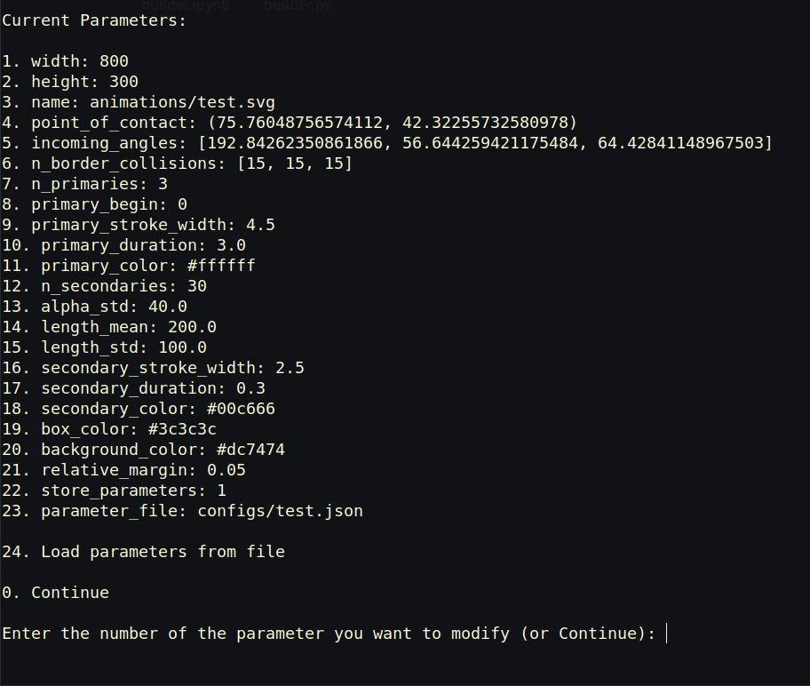
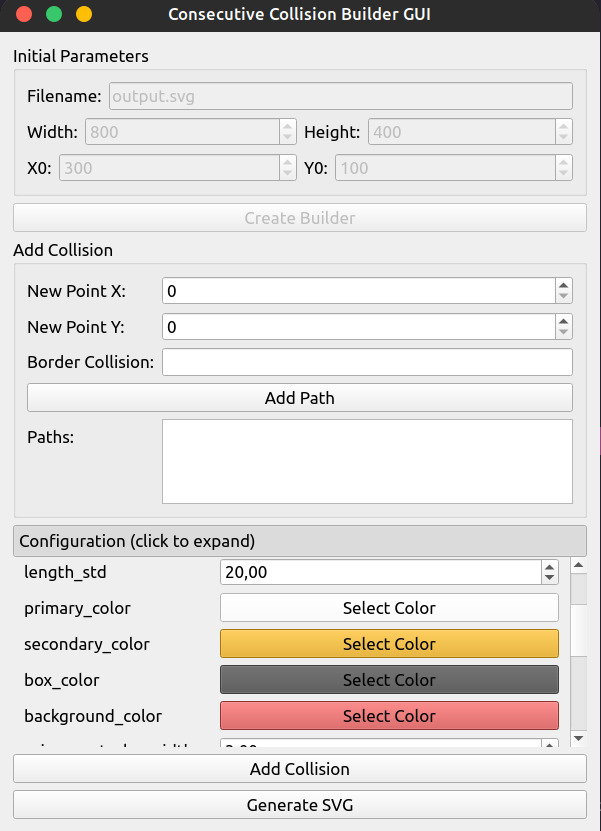

# SVG Collisions


---

**These `svg` files are easy to understand. By modifying them yourself you can truly take these animations to the next level!**

---

## How to?

### Single collision
Either load a predefined file
```python
python3 collision_builder.py configs/example.json
```
or configure your own collision
```python3
python3 collision_builder.py
```
via a CL interface:



### Multiple collisions

via graphical user interface

```python3
python3 consecutive_collision_gui.py
```


or specify paths directly in `consecutive_collisions.py`!


### More

- `configs/` contains several predefined examples `json` files.
- `notebooks/` jupyter notebooks that were used to work out the right algorithm and might give a "look behind the curtain" if you're interested in the calculations. 
- `animations/` a few examples.


