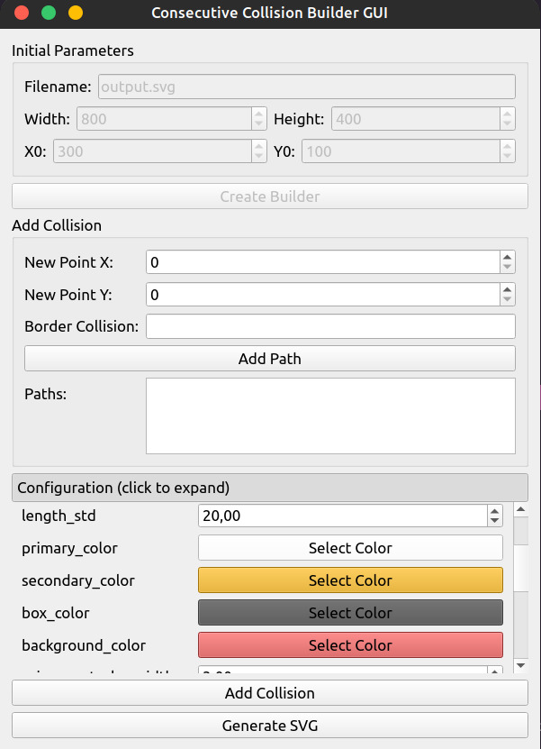

# SVG Collisions


## How to?

### Single collision
Either load a predefined file
```python
python3 collision_builder.py configs/example.json
```
or configure your own collision
```python3
python3 collision_builder.py
```
via a CL interface:


### Multiple collisions

via graphical user interface

```python3
python3 consecutive_collision_gui.py
```


or specify paths directly in `consecutive_collisions.py`!


